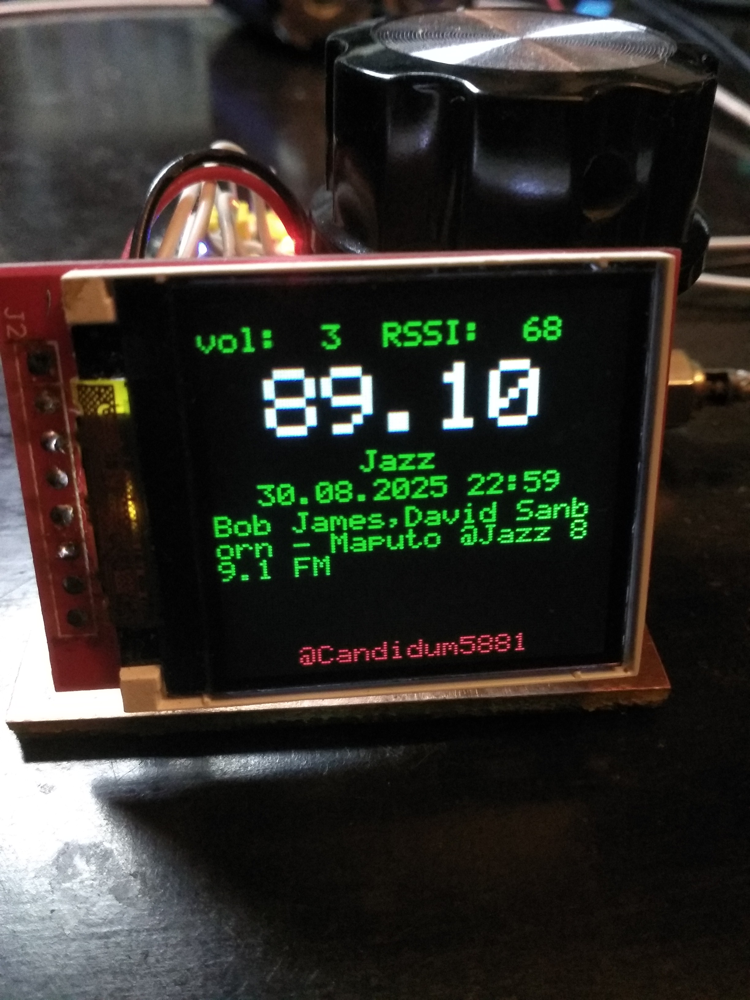

# Радиоприёмник на RDA5807 с поддержкой RDS
Отображается название станций (блок 0A/0B), дата и время (блок 4A) и 
радиотекст (блок 2A). Использован микроконтроллер STM32F103C8T6 и TFT 
дисплей 128x128 на ST7735. Код написан на C с использованием библиотеки 
LibopenCM3. Отличается хорошей чувствительностью и очень приличным 
качеством звучания плюс кварцевая стабилизация.

# RDS-enabled RDA5807 radio
Shows the name of the stations (block 0A/0B), date and time (block 4A) 
and Radiotext (Block 2A). STM32F103C8T6 microcontroller and TFT 128x128 
display on ST7735 was used. The code is written in C using the 
LibopenCM3. It is characterized by good sensitivity and very decent 
sound quality plus quartz stabilization.

# Instructions
 
 1. $sudo pacman -S openocd arm-none-eabi-binutils arm-none-eabi-gcc arm-none-eabi-newlib arm-none-eabi-gdb
 2. $git clone https://github.com/5881/RDA5807_RDS.git
 3. $cd RDA5807_RDS
 4. $git submodule update --init # (Only needed once)
 5. $TARGETS=stm32/f1 make -C libopencm3 # (Only needed once)
 6. $make 
 7. $make flash

Александр Белый 2025

@candidum5881
